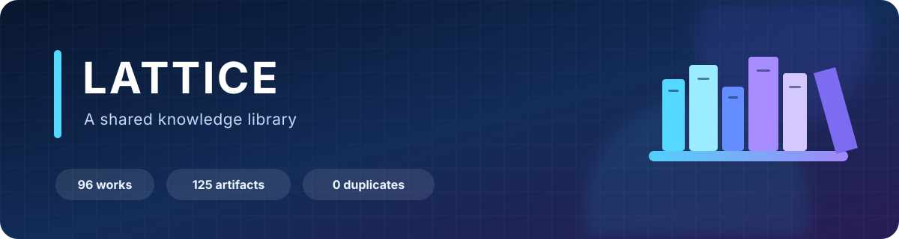

<p align="center">
  
</p>

<p align="center">
  <strong>96 reader-visible works</strong> · <strong>125 readable artifacts</strong> ·
  <strong>0 exact duplicates</strong> · <strong>12 shelf views</strong>
</p>

<p align="center">
  <strong>A shared knowledge library.</strong> Local-first on macOS and Windows,
  with an immersive PDF/EPUB reader and searchable notebook.
</p>

---

Lattice keeps the collection on your computers, tracks where every item
came from, and turns PDFs, EPUBs, papers, specifications, and course notes into
one reading workspace. The existing catalog remains a deep computer-science
collection, while the subject model is intentionally broad enough for electrical
engineering, computer engineering, mathematics, physics, and future fields. The
native app is the primary experience; the browser interface is a portable
fallback built from the same shelf UI.

| | Go here when you want to… |
|---|---|
| 📚 **[Browse the catalog](CATALOG.md)** | Inspect every local work, source, edition, access note, and file path. |
| 🧭 **[Follow the study guide](STUDY_GUIDE.md)** | Work through a staged curriculum with projects and exit criteria. |
| 🗂️ **[Review the subject taxonomy](library-taxonomy.json)** | See stable subject IDs, current topic defaults, and selected work overrides. |
| 🧠 **Use the native notebook** | Search notes, highlights, bookmarks, and indexed book content across the library. |
| 🧾 **[Read the library rules](LIBRARY_RULES.md)** | Understand naming, deduplication, metadata, and remote-storage policy. |
| 🔎 **[Inspect provenance](notes/provenance/)** | Review import history, source gates, licenses, and conversion boundaries. |

## Native Mac app

Build the application once from the repository:

```bash
./scripts/build-macos-app.sh
open "Lattice.app"
```

The build is staged, signed, and verified before replacing an existing app. The
bundle includes its shelf interface, EPUB enhancements, notebook workspace, and
local Python service. Reading payloads remain external in the selected library
folder.

On first launch, the app finds the repository automatically or asks you to
choose a folder containing `CATALOG.md` and `library-taxonomy.json`. That
location is saved, so the app does not have to remain beside the repository.
Python 3 is currently required to run the loopback library service.

### Native PDF reading

PDFs open in a PDFKit workspace with:

- continuous, single-page, and two-page spread modes;
- page labels, direct page entry, and thumbnails;
- fit-page, zoom, and focus mode;
- whole-document search with result navigation;
- page bookmarks and page notes;
- persistent yellow text highlights;
- selected-text quotation capture;
- background text indexing for full-library search;
- exact resume position; and
- active-time reading sessions.

### EPUB reading

EPUBs use the shared WebKit renderer plus a native-only enhancement layer:

- chapter navigation and searchable contents;
- native notebook search across EPUB chapter text after chapters are opened;
- chapter/page progress and bookmarks;
- durable quotations and notes stored in the native database;
- serif, sans-serif, and code fonts;
- text size, spacing, page width, paper, sepia, and night tones;
- focus mode and resize-safe pagination; and
- active-time reading sessions.

### Unified notebook and search

The native workspace combines reader-created data across every book:

- notes and quotations;
- PDF and EPUB highlights;
- bookmarks;
- active reading sessions; and
- locally indexed content.

Use **Command-Shift-N** for the notebook. Its search field queries notes and
locally indexed PDF pages and EPUB chapters.

## Reader data and privacy

Progress, bookmarks, annotations, notes, preferences, and sessions are stored in
a versioned SQLite database:

```text
~/Library/Application Support/CS Library/Library.sqlite
```

The legacy `CS Library` directory name above is a compatibility storage ID; it
does not change when the visible product name changes. The app creates daily
local backups and supports complete JSON export/import plus human-readable
Markdown export. Reader state has no telemetry or cloud synchronization.
Syncthing can separately synchronize reading payloads and their metadata
sidecars, and optional Codex-assisted import is the only feature that may use an
external model.

## Sharing Lattice with Syncthing

The Git checkout is also the Syncthing folder. A fresh clone already contains
the complete empty payload scaffold, including the known nested collections:

```text
books/
├── art-of-hpc/
└── software-foundations/
papers/
└── mit-6006/
lectures/
```

When accepting the shared folder, choose the repository root—the folder that
contains `CATALOG.md`—and use **Send & Receive**. Do not create separate
Syncthing folders for `books/`, `papers/`, or `lectures/`. The checked-in
`.stignore` shares only private payloads and sidecars inside those roots. It
explicitly excludes Git-owned `.gitkeep` placeholders, the curated
`lectures/catalog.json`, and incomplete upload files. A sidecar such as
`books/example.pdf.library.json` travels beside its payload. GitHub remains the
source for the curated catalog, taxonomy, source metadata, and app; Git
internals, build output, and private reader state stay local to each computer.

Use the visible Syncthing label **Lattice** while keeping the established
folder ID, `cs-library-3b8290f24f15`. The stable ID is the actual Syncthing
identity, so an existing hub can change only the label without re-pairing or
moving data. See the
[clone-and-connect instructions](docs/SYNCTHING_SETUP.md) for the exact Windows,
macOS, and Syncthing paths.

## Windows app

The Windows package provides the same shelf, search, study documents, EPUB
reader, and PDF access in a native WPF/WebView2 window. It includes its own
loopback-only server, so the packaged app does not require Python or .NET to be
installed on your cousin's computer.

For the fast path, install Git for Windows first, then run these commands in
PowerShell:

```powershell
winget install --id Git.Git -e --source winget
```

Close and reopen PowerShell if Git was just installed, then run:

```powershell
git clone https://github.com/dreichner2/Lattice.git "$HOME\Lattice"
cd "$HOME\Lattice"
& ".\windows\setup\Install Lattice and Connect.cmd"
```

The setup downloads and installs the pinned Lattice `v2.0.2` release for the
current user, installs official Syncthing `2.1.3` through WinGet when needed,
selects this clone as the library, configures the Mac mini hub and shared folder
on the Windows side, starts both apps, and copies the Windows Syncthing Device ID.
It does not use OneDrive. The interactive happy path is designed to take less
than two minutes; download, package-install, security-scan, and first-sync time
depend on the PC and connection and are not included in that estimate.

One mutual-approval step cannot be automated safely: send the displayed Device
ID privately to the Mac mini owner. The owner must add that Windows device and
share the existing **Lattice** folder with it. Both devices must be online at the
same time for the first transfer. No content folders need to be created by hand.

Installed Windows builds use versioned directories under
`%LOCALAPPDATA%\Programs\Lattice\versions`. The updater accepts only a newer,
stable release whose exact manifest bytes pass the embedded release-key
signature check and whose versioned GitHub asset matches the signed size and
SHA-256. A candidate becomes active only after its own isolated loopback service
and the complete shared WebView interface have both passed health checks.
Promotion re-checks the active authority so a slower older candidate cannot
replace a newer version; the previous healthy version remains available for
rollback.

This release-signing check is independent of Windows Authenticode. The current
executable is not Authenticode-signed, so Microsoft Defender SmartScreen or Smart
App Control may warn or block it on some Windows configurations. Do not disable
Windows security controls to install Lattice; stop and contact the maintainer if
Windows blocks it.

To build it on Windows:

```powershell
.\windows\build-windows.ps1
```

Windows web-reader progress and preferences are mirrored to a private SQLite
database under `%LOCALAPPDATA%\CS Library`. This compatibility storage path is
intentionally unchanged and is local to that PC. Syncthing follows the
payload-only scope in `library-layout.json`, not the catalog, app source, or a
live SQLite database.

See [Windows build, install, and data boundaries](windows/README.md).

See [Reader data, backup, and recovery](docs/READER_DATA.md).

## Adding material

Drag supported files onto the library window or use the dedicated **Add** button.
Choose whether an item belongs under `books/`, `papers/`, or `lectures/`; the
app validates it, chooses a collision-safe filename, and makes it visible
without a restart. Each imported payload receives an adjacent private sidecar by
appending `.library.json` to its full filename:

```text
books/example.pdf
books/example.pdf.library.json
```

The sidecar stores editable title, author, year, subject, and topic fields plus
server-owned integrity and provenance fields. It is ignored by Git and
synchronized with the payload by Syncthing, so both readers see the same
classification without editing the curated catalog.

When the local Codex CLI is installed and signed in, import can ask
`gpt-5.6-luna` to suggest metadata and a subject. The request contains the
filename, selected material kind, locally extracted publication metadata, and
allowed subject list—not the document bytes or full text. PDF enrichment is
filename-only; EPUB fields come from its package metadata. The Codex run is
ephemeral, read-only, and launched with local tools disabled. Suggestions
remain editable. If Codex is missing, signed out,
unavailable, or returns invalid data, the import still succeeds with local
fallback metadata under **Other**. Each computer that wants this optional
enrichment signs in to Codex locally with that person's own ChatGPT account:

```powershell
powershell -ExecutionPolicy ByPass -c "irm https://chatgpt.com/codex/install.ps1 | iex"
codex login
codex login status
```

Lattice's core shelf, reader, search, drag-and-drop import, and manual metadata
work without Codex. Never share a ChatGPT login or copy a Codex credential file
between computers. See the official [Codex authentication
guide](https://learn.chatgpt.com/docs/auth), the
[`gpt-5.6-luna` model page](https://developers.openai.com/api/docs/models/gpt-5.6-luna),
and [Importing and metadata sidecars](docs/IMPORTING.md).

The repository tracks hidden placeholders for `books/`, `papers/`, `lectures/`,
and known nested collections, but ignores their payloads. A clone therefore has
the right paths without putting copyrighted material on the public remote.

## Browser option

Double-click `open-library.command`, or run:

```bash
./open-library.command
```

The browser version provides the complete shelf, subject and metadata search,
drag-and-drop import, live file updates, the EPUB reader, PDF/TXT access,
favorites, reading status, and study documents. Native PDFKit, the durable
SQLite notebook, native annotations, and global indexed search require the Mac
app.

The service binds only to `127.0.0.1`. It validates the Host header, selected
library identity, catalog allowlist, paths, origins, EPUB archive limits, and
token-protected local file actions.

The interface also includes a dedicated **Video lectures** hall with 58 course
tracks and 1,452 searchable lectures. Video stays with its official publisher;
the repository stores only source metadata and video IDs. See the
[video-catalog provenance note](notes/provenance/free-video-lectures-2026-08-21.md)
for inclusion rules and licensing boundaries.

## Start with the current computer-science collection

The first maintained collection is computer science. Choose one lane and begin
building things immediately; other subjects can use their own guides without
changing the library model:

- **Java-first:** `books/think-java-2e.pdf` → small console projects →
  `papers/mit-6006/` → `books/jls-26.pdf` and `books/jvms-26.pdf` as references.
- **General CS:** `books/think-python-2e.pdf` →
  `books/openstax-intro-cs.pdf` → `books/sicp.pdf` → algorithms and systems.
- **Already programming:** `books/clrs-4e.pdf` → `books/ostep.pdf` →
  `books/crafting-interpreters.epub`, filling math gaps with
  `books/concrete-math-2e.pdf`.

The [study guide](STUDY_GUIDE.md) expands those entry points into ten stages with
projects and exit criteria.

## Current computer-science shelves at a glance

| Shelf | Works | Good first pick |
|---|---:|---|
| Foundations & programming | 7 | Think Java 2e or Think Python 2e |
| Algorithms & data structures | 2 | MIT 6.006 lecture notes |
| Systems, networks & security | 5 | OSTEP |
| Software engineering & design | 6 | Software Engineering at Google |
| Mathematics & statistics | 8 | Introduction to Probability or OpenIntro Statistics |
| AI & machine learning | 9 | ISL with Python |
| Languages & formal methods | 7 | Crafting Interpreters |
| Computer graphics & vision | 2 | PBRT 4e or Szeliski |
| Ethics & professional practice | 1 | ACM Code of Ethics |
| Open textbooks & reference | 10 | Book of Proof or Linear Algebra Done Right |
| Research papers | 26 | Attention Is All You Need or Raft |

## Everyday shelf commands

Run these from the repository root:

```bash
# See what is physically present on this computer
python3 scripts/fetch.py list

# Validate format, byte count, metadata path, and SHA-256
python3 scripts/fetch.py verify

# Check metadata coverage, filenames, manifest parity, and duplicates
python3 scripts/fetch.py audit

# Browse curated authorized downloads
python3 scripts/fetch.py book
python3 scripts/fetch.py sets

# Examples
python3 scripts/fetch.py book think-java
python3 scripts/fetch.py book mit-6006
python3 scripts/fetch.py download 1706.03762
python3 scripts/fetch.py rfc 9110

# Deterministic fetch-tool tests
python3 scripts/fetch.py self-test

# Update the manifest after an intentional shelf change
python3 scripts/fetch.py manifest
```

Downloads are streamed into a temporary file, validated before installation,
hashed, and recorded under `metadata/`. ZIP, EPUB, and TGZ archives are
structurally checked during verification.

These curated fetch commands are separate from normal in-app imports. In-app
imports use adjacent `.library.json` sidecars so private additions can sync
without modifying Git-tracked metadata.

## Development and tests

Portable checks:

```bash
python3 -m py_compile scripts/library_ui.py scripts/cross_platform_server.py windows/server_bootstrap.py
python3 -m unittest discover -s tests -p 'test_*.py' -v
node --check ui/app.js
node --check native/ImmersiveEPUB.js
node --check native/LibraryWorkspace.js
node --check native/SharedReaderState.js
node --test tests/*.mjs
bash -n scripts/build-macos-app.sh
```

The macOS workflow additionally:

- compiles and exercises the SQLite reader store;
- compiles the full AppKit/PDFKit application;
- validates bundled resources and `Info.plist`;
- verifies the ad-hoc code signature; and
- publishes a downloadable app artifact for each pull request run.

See [Architecture](ARCHITECTURE.md), [Security](SECURITY.md), and
[Contributing](CONTRIBUTING.md).

## Repository layout

```text
cs-library/
├── .stignore                  # data-only Syncthing allowlist
├── library-layout.json        # required folders and shared-data contract
├── library-taxonomy.json      # stable cross-subject classification authority
├── README.md
├── CATALOG.md
├── STUDY_GUIDE.md
├── LIBRARY_RULES.md
├── ARCHITECTURE.md
├── SECURITY.md
├── CONTRIBUTING.md
├── CHANGELOG.md
├── docs/
│   ├── READER_DATA.md
│   ├── IMPORTING.md
│   └── SYNCTHING_SETUP.md
├── assets/
├── metadata/
├── manifests/
├── notes/provenance/
├── native/
│   ├── CSLibraryApp.swift
│   ├── ReaderStore.swift
│   ├── ReaderBridge.swift
│   ├── NativePDFReader*.swift
│   ├── ImmersiveEPUB.js
│   ├── LibraryWorkspace.js
│   └── SharedReaderState.js
├── windows/                   # WPF/WebView2 host and portable package builder
├── scripts/
│   ├── library_ui.py
│   ├── cross_platform_server.py
│   ├── build-macos-app.sh
│   ├── fetch.py
│   └── build_readable_books.py
├── tests/
├── ui/
├── books/                     # tracked scaffold; payloads ignored
│   ├── art-of-hpc/
│   └── software-foundations/
├── papers/                    # tracked scaffold; payloads ignored
│   └── mit-6006/
└── lectures/                  # tracked scaffold; payloads ignored
```

## Why the remote is metadata-first

This library mixes open works, publisher-authorized personal copies, and legacy
imports whose redistribution history was not preserved. GitHub stores the
catalog, metadata, checksums, provenance, and tooling, while reading payloads
remain local. This keeps the remote lawful, fast to clone, and useful for
answering:

- What belongs on the shelf?
- Which exact bytes were verified?
- Where did an authorized copy come from?
- Which works can be restored from an official source?
- What is missing or newly added?

## Important access boundary

“Free to read” does not automatically mean “free to redistribute, transform, or
process with generative AI.” Each work retains its own terms. In particular,
the current OpenStax terms permit human reading but restrict generative-AI
training or ingestion without permission. The import assistant therefore uses
only filenames and embedded publication metadata; it does not send payload bytes
or full text. Any future content-processing feature must honor recorded access
terms and remain separately reviewable.

## Current integrity state

- 83 cataloged works represented by 112 cataloged artifacts
- 13 additional held arrivals appear automatically when their local files are
  present, producing 96 reader-visible works and 125 readable artifacts
- 126/126 manifest entries passed format, size, metadata, and SHA-256
  verification on the maintained local shelf; one retained ZIP source bundle is
  intentionally not a reader-visible artifact
- 0 byte-identical duplicate groups
- 0 filenames outside the short kebab-case convention
- OSTEP chapter copies and the Crafting Interpreters sample were removed after
  complete retained editions were verified
- ten web/source bundles were converted into searchable EPUB editions with
  conversion boundaries recorded under `notes/provenance/`
- canonical inventory: `manifests/library.sha256`

The repository currently does not declare a general software license. Book
rights and source terms are tracked independently from the application source.
